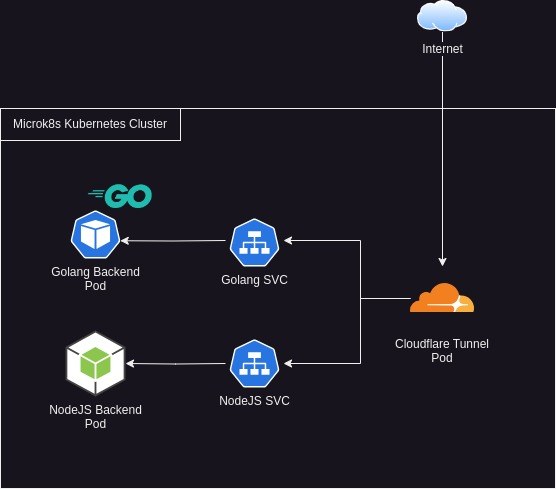

# Interview SRE Pintu

For the test, I'm creating a middleware using both golang and nodejs.

### Diagram


### API Docs
- **GET /status**
returns json: 
```
`{
	"Status":"OK",
	"Time":"2023-06-27T04:42:47.856Z",
	"Engine":"NodeJS Server"
}`
```
- **GET /weather**
get weather data for Jakarta, from openweathermap, cache the result for 15 minutes, then returns json: 
```
{
  "coord": {
    "lon": 106.8451,
    "lat": -6.2146
  },
  "weather": [
    {
      "id": 721,
      "main": "Haze",
      "description": "haze",
      "icon": "50d"
    }
  ],
  "base": "stations",
  "main": {
    "temp": 32.19,
    "feels_like": 39.19,
    "temp_min": 30.5,
    "temp_max": 33.45,
    "pressure": 1009,
    "humidity": 72
  },
  "visibility": 5000,
  "wind": {
    "speed": 1.54,
    "deg": 60
  },
  "clouds": {
    "all": 40
  },
  "dt": 1687840816,
  "sys": {
    "type": 2,
    "id": 2073276,
    "country": "ID",
    "sunrise": 1687820554,
    "sunset": 1687862898
  },
  "timezone": 25200,
  "id": 1642911,
  "name": "Jakarta",
  "cod": 200
}
```

### CI/CD Features
- Unit testing for golang and nodejs
- Docker image build and push to docker hub
- Deploy with helm to self hosted microk8s cluster via tailscale network

### Endpoint
#### Golang Backend: 
- https://pintu-golang.kris.my.id/status
- https://pintu-golang.kris.my.id/weather
#### NodeJS Backend
- https://pintu-nodejs.kris.my.id/status
- https://pintu-nodejs.kris.my.id/weather